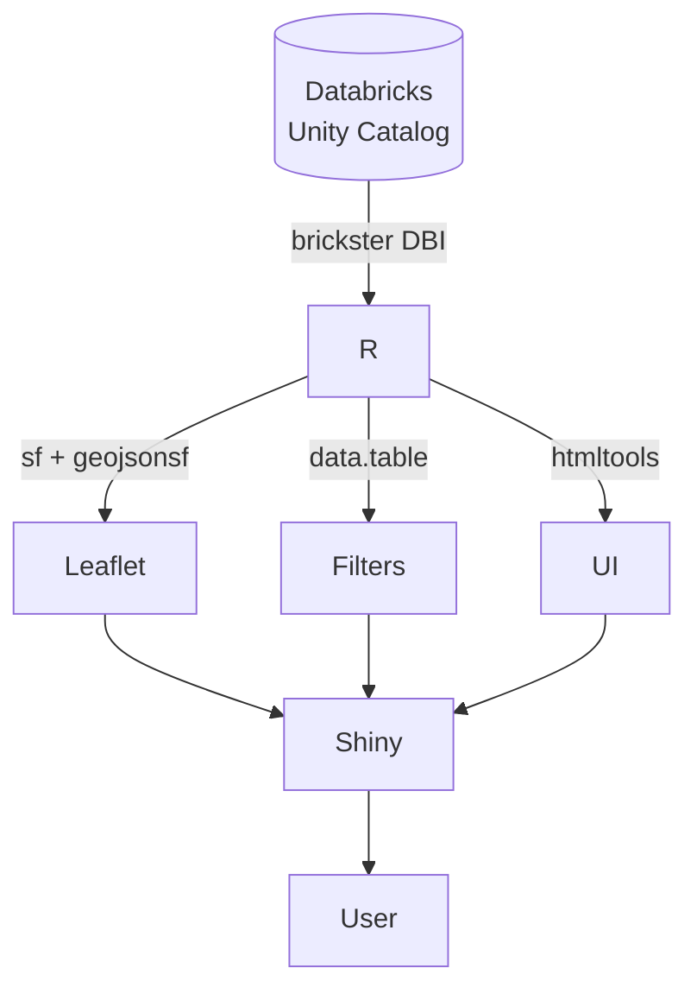

---
tags:
  - flood-guidance
  - shiny
  - databricks
  - architecture
  - environment-agency
created: 2026-06-16
status: active
---

# FGS Flood Guidance Dashboard

> [!abstract] Summary
> An R Shiny operational dashboard for Environment Agency forecasters to interrogate the Flood Guidance Statement (FGS) — visualising risk polygons, affected EA Warning Areas, and parliamentary constituencies, with full filtering by source, risk matrix cell, and intersection threshold.

---

## Context

### What is the FGS?

The **Flood Guidance Statement** is a 5-day probabilistic flood risk forecast issued by the Flood Forecasting Centre. Each statement contains:

- A **headline** summarising the overall risk picture
- **Risk polygons** — geographic areas at elevated flood risk, each assigned a position on the 4×4 risk matrix
- **Per-source narratives** — short risk descriptions for River, Coastal, Surface water, and Groundwater
- **England-wide forecast** — a broader narrative
- A **PDF** of the full statement

The matrix combines **Likelihood** (Very Low → High, y-axis) with **Impact** (Minimal → Severe, x-axis) to produce one of four colour bands:

| Colour | Meaning |
|--------|---------|
| 🟢 Green | Low combined risk |
| 🟡 Yellow | Elevated, monitor |
| 🟠 Amber | Significant risk |
| 🔴 Red | Highest risk |

### Who uses this dashboard?

Environment Agency **flood forecasters** and **incident managers** who need to:
- See which EA Warning Areas and parliamentary constituencies are under elevated risk
- Export affected-area lists with MP contact details for briefing packs
- Track how risk evolves across the 5-day forecast window
- Cross-reference against the FGS PDF

---

## Architecture

### Technology choices



> [!decision] Why R Shiny, not Python/Dash?
> The FGS pipeline is already in Databricks (Python/PySpark). Shiny was chosen for the dashboard because:
> - The team has existing R expertise
> - `leaflet` for R has superior Shiny integration vs Plotly Dash
> - `data.table` makes in-session filtering trivial at the polygon volumes involved
> - Posit Connect is the internal deployment target

> [!decision] Why brickster, not ODBC?
> `brickster` provides a DBI driver wrapping the Databricks SQL Statement Execution API — no ODBC driver installation needed on the server. Per-query connections (connect → query → disconnect) are used throughout rather than a long-lived connection, because the REST API has no per-connection setup cost worth amortising and per-query connections survive Posit Connect's idle-app suspension cleanly.

> [!decision] Why data.table, not dplyr?
> `data.table` was chosen for in-memory work because:
> - Join syntax (`X[Y, on=...]`) is explicit about join direction and avoids implicit column conflicts
> - No tidyverse dependency chain to manage on Posit Connect
> - Consistent with the team's existing preference

### Data flow

```
fgs_statements           → statement picker, headline, per-source narratives, PDF link
fgs_risk_polygons        → FGS polygon layer, polygon count card
fgs_ea_area_intersections → EA Warnings list, EA count card, EA map layer
fgs_constituency_intersections → Constituency count card, constituency map layer
ea_flood_warning_areas   → EA FWA geometry (for map)
ea_flood_alert_areas     → EA FAA geometry (for map)
parliamentary_constituencies → Constituency geometry (for map)
ea_area_constituency_lookup  → Constituency names per EA area (for search + CSV)
mp_contact_details           → MP contact info (for CSV export)
```

All tables live in a Unity Catalog identified by `FGS_CATALOG` and `FGS_SCHEMA` environment variables. No table names are hard-coded.

---

## Key Design Decisions

### Filtering in R, not SQL

All polygon/EA-area/constituency filtering (source type, risk matrix cell, intersection threshold) is done in R with `data.table` after a single per-statement-day fetch — not via dynamic SQL `WHERE`/`IN` clauses.

> [!reasoning]
> At the volumes involved (tens of polygons, hundreds of EA areas per day), R-side filtering is negligible. The round-trip cost of additional SQL queries — especially on a REST-based warehouse — would dominate. Dynamic SQL also makes debugging harder: a fixed query can be lifted directly into Databricks SQL for investigation.

### leafletProxy, not renderLeaflet

The map is constructed once via `renderLeaflet()`. All layer updates use `leafletProxy()` + `clearGroup()` inside `observe()` blocks.

> [!reasoning]
> A full re-render on every filter change would reset the user's pan and zoom state. Forecasters routinely zoom into a specific region (e.g. Cumbria) and adjust filters without wanting to lose their viewport.

### Geometry as GeoJSON strings end-to-end

All geometry is stored as GeoJSON strings in Delta, parsed in R via `geojsonsf::geojson_sfc()`.

> [!reasoning]
> GeoJSON is the native format for Leaflet. Converting to WKT in the pipeline and back to GeoJSON in R would add a transformation step with no benefit. `geojsonsf` parses a character vector in one vectorised call.

### sf geometry validity

Some source polygons have degenerate rings (duplicate vertices, self-intersecting edges) that cause `s2_union_agg` to error when `sf::st_union()` is called under the s2 spherical geometry engine.

> [!decision] Use bbox centre for popup placement, not st_centroid
> `st_union()` → `st_centroid()` kept crashing on different areas' geometry. Since the popup only needs an approximate anchor point, the bounding-box centre (`(xmin+xmax)/2`, `(ymin+ymax)/2`) is used instead. This sidesteps geometry validity entirely and is computed from raw coordinates.

### Constituency filtering gap (fixed)

The original constituency layer fetched all constituencies for the statement-day without applying the sidebar's source/matrix/threshold filters. This was inconsistent with how polygons and EA areas behave.

> [!decision] Schema confirmed before fixing
> The fix required `source`, `risk_x`, `risk_y`, `intersection_pct` columns in `fgs_constituency_intersections`. Rather than guessing column names (which caused bugs elsewhere — incorrect `groundwater` source code, wrong EA area type values), the schema was confirmed via Databricks Catalog Explorer before the fix was written.

### Statement data fetched once per session

`fetch_recent_statements(100)` runs once at session start. The result is stored in `recent_rv` (a `reactiveVal`). All statement metadata — including headline, per-source narratives, PDF URL, and the `selected_statement()` lookup — is served from this in-memory table.

> [!reasoning]
> A network round-trip to re-fetch statement metadata on every filter change would be wasteful. The statements table is small and changes infrequently (one new row per FGS issuance). A **Refresh statements** button re-runs the fetch on demand to pick up new statements without a full app restart.

### Reference data fetched once per session

`ea_constituency_lookup` and `area_constituency_map` (MP contact details and constituency-per-EA-area lookup) are fetched once at session start, not per filter change.

> [!reasoning]
> These are static reference tables. The main benefit is that the area-list search (which joins constituency names for text matching) and the CSV export both reuse the same in-memory object rather than hitting Databricks separately.

---

## UI Structure

```
┌─────────────────────────────────────────────────────┐
│ FGS Flood Guidance                                   │
├──────────┬──────────────────────────┬───────────────┤
│ Sidebar  │ Centre                   │ Right panel   │
│          │                          │               │
│ Statement│ Title / subtitle         │ Polygon count │
│ picker   │ [Headline notice]        │ EA area count │
│ Refresh  │ [Quiet-state notice]     │ Constituency  │
│          │ ┌──────────────────────┐ │ count         │
│ Layers   │ │ Leaflet map          │ │               │
│ - Polys  │ │ [Loading spinner]    │ │ Affected EA   │
│ - EA     │ └──────────────────────┘ │ Warnings list │
│   - FWA  │ England forecast         │ [Search box]  │
│   - FAA  │ River                    │ [Rows with    │
│ - Const  │ Coastal                  │  click-to-map]│
│          │ Surface                  │               │
│ Sources  │ Ground                   │ [Export CSV]  │
│ Matrix   │ [View FGS PDF]           │               │
│ Threshold│                          │               │
│ Day      │                          │               │
└──────────┴──────────────────────────┴───────────────┘
```

---

## Features

### Risk matrix filter

A 4×4 CSS grid of checkboxes, one per matrix cell. Each cell is coloured by its risk band. Defaults: all cells with impact > Minimal ticked (x > 1). Server reads `mtx_{x}_{y}` input IDs and builds a data.table of selected `(x, y)` pairs, then inner-joins polygons/areas against it.

### Click-through: area list → map

Each row in the Affected EA Warnings list has an `onclick` attribute that calls `Shiny.setInputValue('area_row_click', '<ea_area_code>', {priority: 'event'})`. The server-side `observeEvent` fetches the area's geometry, computes a bounding box, and calls `leafletProxy` → `flyToBounds` + `addPopups`.

### Area list search

`textInput("area_search")` filters the rendered list against both `ea_area_name` and `constituency_names` (case-insensitive literal match). Constituency names are joined in once from `area_constituency_map` (the session-cached MP lookup) — not re-queried.

### Loading spinner

Three `reactiveVal` busy flags (`busy_polygons`, `busy_ea`, `busy_const`) are set `TRUE` when `filters()` invalidates and cleared at each exit path of the corresponding layer observer. A `renderUI` overlay (`map-spinner-overlay`) sits in a `position: relative` wrapper around the map and shows a CSS-animated spinner while any flag is `TRUE`.

### Coloured info boxes

Source-level risk text (e.g. "MEDIUM risk across…") is matched against `HIGH / MEDIUM / LOW / VERY LOW` keywords (checked in descending risk order; `VERY LOW` uses a negative lookbehind to avoid matching `LOW`). The matching FGS hex colour is applied as `border-left-color` inline. England forecast uses a fixed blue border.

---

## Environment Variables

| Variable | Description |
|----------|-------------|
| `DATABRICKS_HOST` | Workspace URL (with `https://`) |
| `DATABRICKS_TOKEN` | Personal access token |
| `DATABRICKS_WAREHOUSE_ID` | SQL warehouse ID (not cluster ID) |
| `FGS_CATALOG` | Unity Catalog name |
| `FGS_SCHEMA` | Schema within that catalog |

Validated at startup in `global.R` — the app stops with a clear error message rather than failing silently on first user interaction.

---

## Known Issues / Notes

> [!warning] No R interpreter in remote environment
> `Rscript` is not available in the remote execution sandbox. All verification has been via code review and `git diff`, not by running the app. Functional testing must be done on the local R/Posit Connect deployment.

> [!note] Auto-merge CI behaviour
> Every push to `claude/project-migration-qdyznp` triggers an external automation that opens a PR into `main` and merges it within seconds. GitHub then deletes the head branch. This means the branch will always show "1 ahead, 1 behind" after a push — the behind commit is just the auto-merge. Run `git fetch origin main && git merge origin/main --no-edit && git push` to resync.

> [!note] Magenta diagnostic tripwire
> In the polygon layer observer, unmatched `risk_colour` values fall back to `#ff00ff` (magenta) rather than a silent grey. This is intentional — a visible signal on the map that a colour value from the database didn't match the expected `Red/Amber/Yellow/Green` strings.

---

## File Map

| File | Role |
|------|------|
| `global.R` | Library loads, env var validation, shared constants (colour palette, risk matrix, table names) |
| `data.R` | All Databricks queries — one function per query, per-query connections |
| `ui.R` | Declarative layout, inline CSS, `matrix_filter_ui()` builder |
| `server.R` | All reactive logic, layer observers, output renderers |
| `.env` | Local credentials (not committed) |
| `.env.example` | Template for new developers |
